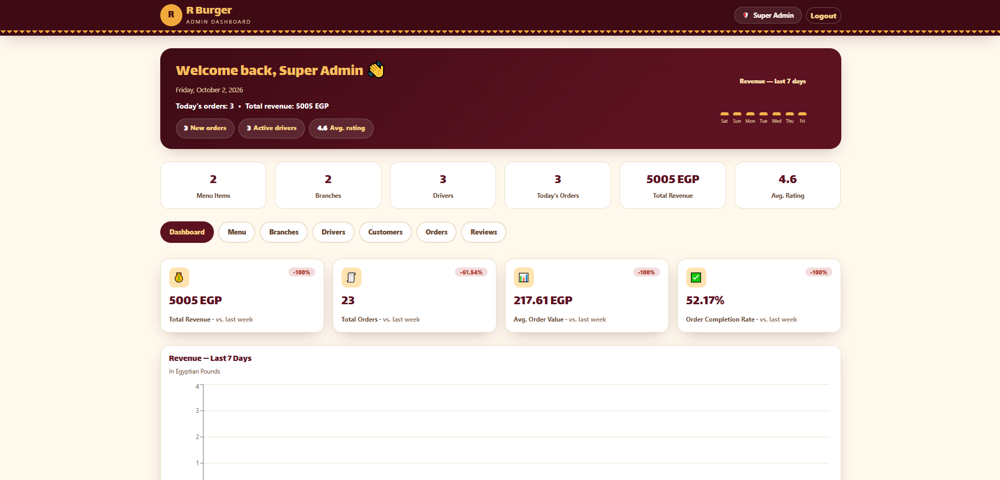
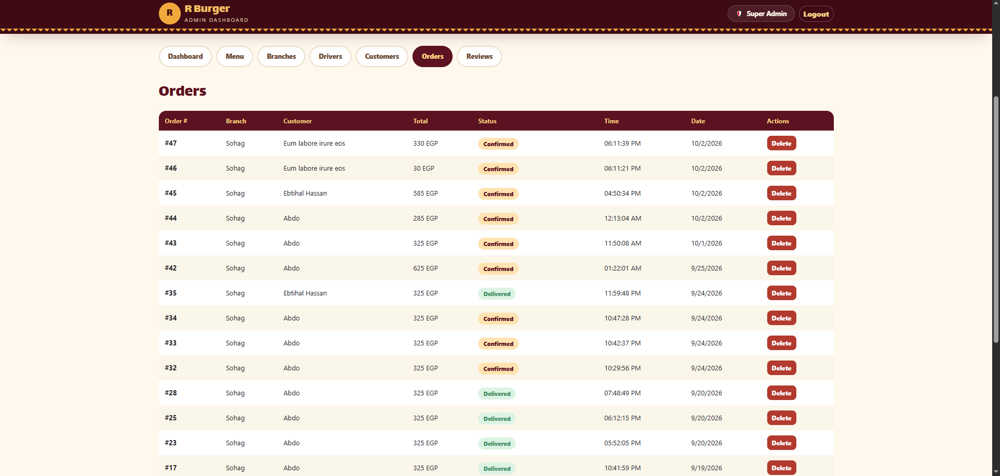
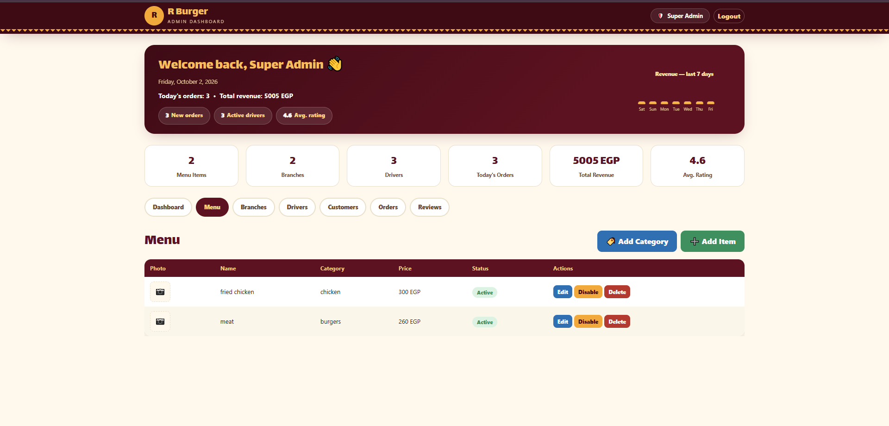
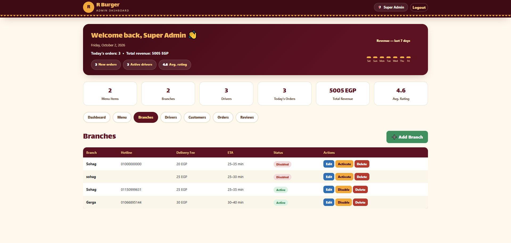
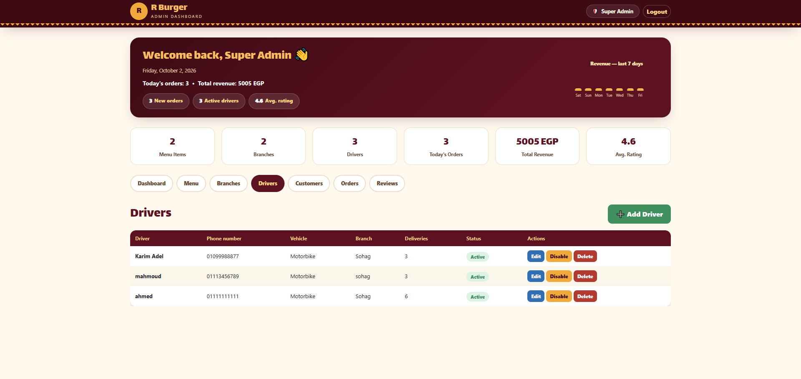
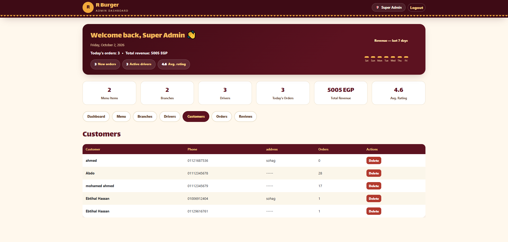
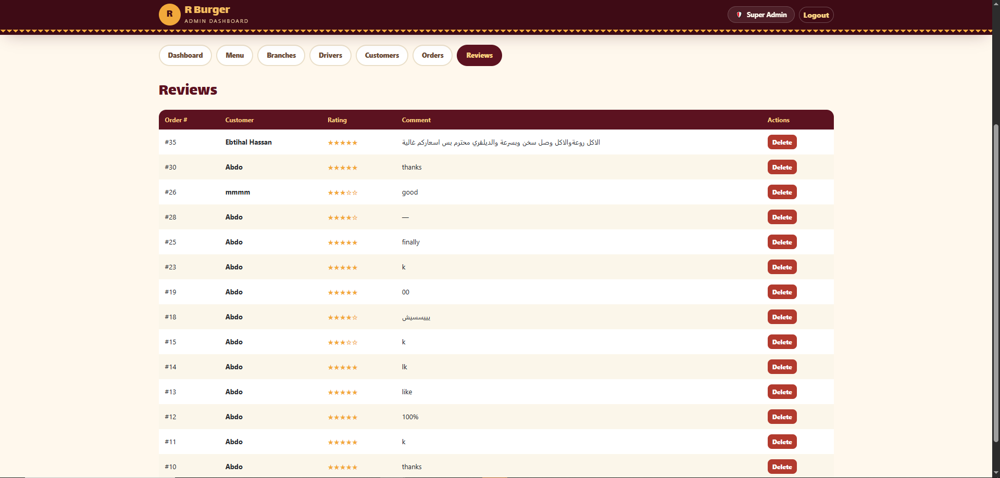

# RB Restaurant Admin Dashboard

A React-based administration dashboard for managing restaurant operations, monitoring business performance, and organizing essential restaurant data through a centralized interface.

🔗 **Live Demo:** [RB Restaurant Admin](https://rb-resturant-admin.vercel.app/)
📂 **Repository:** [GitHub](https://github.com/shahendamohamed22/Rb-resturant-admin)

## Overview

RB Restaurant Admin is a web application designed to simplify restaurant management by bringing operational data and management tools into one dashboard.

The application integrates with backend APIs to retrieve analytics, summarize key business metrics, and manage restaurant resources. Its feature-based structure separates different management responsibilities, making the codebase easier to maintain and extend.

## Features

### Dashboard & Analytics

* Displays key restaurant metrics, including menu items, branches, drivers, orders, revenue, and average customer rating.
* Provides analytics for daily and 30-day reporting periods.
* Presents operational summaries, including active drivers and order statistics.
* Handles dashboard data loading before displaying the main content.

### Order Management

* Provides a dedicated interface for viewing and managing restaurant orders.
* Organizes order-related operations within a separate feature module.
* Integrates with the backend for order data and updates.

### Menu Management

* Includes a dedicated menu management panel.
* Organizes restaurant menu items and their associated data.
* Retrieves menu-related information through API queries.

### Branch Management

* Provides a centralized interface for restaurant branches.
* Displays branch-related information and summary counts.

### Driver Management

* Includes a dedicated panel for managing delivery drivers.
* Uses driver-related data to display total and active driver statistics.

### Customer Management

* Provides a separate interface for accessing customer-related information.

### Reviews Management

* Organizes customer reviews in a dedicated panel.
* Displays average rating information within the dashboard.

### Authentication

* Provides an admin login interface.
* Uses Redux-managed authentication state to determine whether the login screen or dashboard is displayed.

## Tech Stack

| Technology           | Purpose                                                        |
| -------------------- | -------------------------------------------------------------- |
| React 19             | Component-based UI development                                 |
| Vite                 | Development server and production build                        |
| Redux Toolkit        | Global application and authentication state                    |
| React Redux          | Connecting React components to the Redux store                 |
| TanStack React Query | API queries, server-state management, and data synchronization |
| Axios                | HTTP requests to backend APIs                                  |
| React Router         | Application routing                                            |
| Bootstrap 5          | Layout and responsive styling                                  |
| Font Awesome         | Icons                                                          |
| Recharts             | Data visualization                                             |


## Screenshots

### Dashboard


### Orders


### Menu


### Branches


### Drivers


### Customers


### Reviews



## Architecture & Code Organization

The application uses a feature-oriented structure, separating dashboard functionality from individual restaurant management modules.

```text
src/
├── app/
│   ├── store.js
│   └── router.jsx
├── features/
│   ├── auth/
│   │   └── AdminLogin
│   ├── dashboard/
│   │   ├── AdminDashboard
│   │   ├── AnalyticsPanel
│   │   ├── DashboardHero
│   │   ├── DashboardTabs
│   │   ├── StatsRow
│   │   └── dashboard query hooks
│   ├── menu/
│   ├── branches/
│   ├── drivers/
│   ├── customers/
│   ├── orders/
│   └── reviews/
├── shared/
│   ├── api/
│   ├── components/
│   └── design-tokens/
├── App.jsx
└── main.jsx
```

*This is a simplified overview of the repository structure; some directories contain additional files and components.*

### State Management

Redux Toolkit manages global application state, including authentication information. React Redux makes that state available to components.

TanStack React Query handles server data separately from global client state, allowing dashboard features to retrieve the information they need through dedicated query hooks.

### API Integration

Axios provides HTTP communication with the backend. API-related functionality is organized under the shared API layer, while feature-specific query hooks handle data retrieval for their respective modules.

The dashboard combines data from multiple queries to calculate and display operational summaries.

### Component-Based Design

The main dashboard coordinates reusable components such as the header, dashboard hero, statistics row, and navigation tabs. Each management area is rendered through its own feature panel, keeping responsibilities separated.

## Getting Started

### Prerequisites

* Node.js and npm
* Access to the backend API, unless using the mock configuration

### Installation

1. Clone the repository:

   ```bash
   git clone https://github.com/shahendamohamed22/Rb-resturant-admin.git
   ```

2. Navigate to the project directory:

   ```bash
   cd Rb-resturant-admin
   ```

3. Install dependencies:

   ```bash
   npm install
   ```

4. Configure the required environment variables for the backend API in your local `.env` file.

5. Start the development server:

   ```bash
   npm run dev
   ```

6. Open the local URL displayed in your terminal.

### Available Scripts

| Command           | Description                           |
| ----------------- | ------------------------------------- |
| `npm run dev`     | Starts the Vite development server    |
| `npm run build`   | Creates the production build          |
| `npm run preview` | Previews the production build locally |
| `npm run lint`    | Runs ESLint checks                    |

### Mock API Configuration

The application includes a mock API adapter that can be enabled through the `VITE_USE_MOCKS` environment variable.

```env
VITE_USE_MOCKS=true
```

Set this option to `true` to enable the mock adapter. Use `false` when working with the actual backend API. Ensure the required API configuration is set according to the project's implementation.

## Screenshots

Add screenshots of the running application to showcase its main functionality.

| Dashboard & Analytics                     | Order Management                    |
| ----------------------------------------- | ----------------------------------- |
| `` | `` |

| Menu Management                 | Branch Management                       |
| ------------------------------- | --------------------------------------- |
| `` | `` |

Create a `screenshots` folder in the repository and replace these placeholders with the actual screenshots you capture.

## Key Learning Outcomes

* Building a modular React application with feature-based organization.
* Managing global state using Redux Toolkit.
* Separating server state from client state with TanStack React Query.
* Integrating frontend components with backend APIs using Axios.
* Combining multiple API queries to display business analytics.
* Creating reusable dashboard components and management panels.
* Configuring a React application with Vite for development and production builds.

## Author

**Shahenda Mohamed**

Frontend Developer | Electronics & Communications Engineering Student

* GitHub: [@shahendamohamed22](https://github.com/shahendamohamed22)

---

*Built with React, Redux Toolkit, TanStack React Query, and Vite.*
